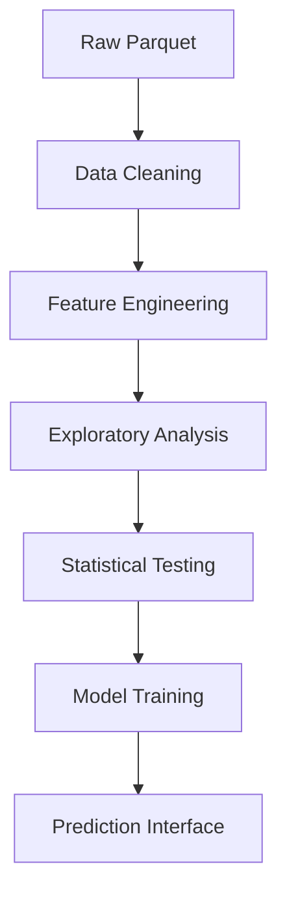

# 🚖 NYC Green Taxi Trip Analysis - October 2024


A comprehensive analytical dashboard for exploring New York City Green Taxi trip data with statistical testing and predictive modeling capabilities.

## Table of Contents
- [Project Overview](#project-overview)
- [Key Features](#key-features)
- [Tech Stack](#tech-stack)
- [Data Pipeline](#data-pipeline)
- [Installation](#installation)
- [Usage](#usage)
- [Analysis Features](#analysis-features)
- [Model Details](#model-details)
- [Roadmap](#roadmap)

## Project Overview
This interactive application provides:
- Exploratory data analysis of October 2024 Green Taxi trips
- Automated data cleaning and feature engineering
- Statistical hypothesis testing
- Visualization of key metrics and trends
- Fare prediction modeling with 4 different algorithms

## Key Features

### 📊 Data Analysis Tab
- **Smart Data Handling**:
  - Automatic missing value imputation (median for numeric, mode for categorical)
  - Temporal feature extraction (hour/day/weekday)
  - Trip duration calculation
  
- **Interactive Visualizations**:
  - Payment type and trip type distributions
  - Trip distance/duration analysis
  - Temporal fare patterns
  - Vendor performance comparisons
  - Tip percentage analysis

- **Statistical Testing**:
  - ANOVA for fare differences
  - Chi-square for categorical relationships
  - Correlation matrix visualization

### 🤖 Model Building Tab
- **Multiple Regression Models**:
  - Linear Regression
  - Decision Tree
  - Random Forest
  - Gradient Boosting
  
- **Performance Metrics**:
  - RMSE, MAE, R² scores
  - Feature importance analysis

### 🔮 Fare Prediction Tab
- Interactive fare estimator
- Detailed fare breakdown visualization
- Model comparison capability

## Tech Stack
| Component | Technology |
|-----------|------------|
| Web Framework | Streamlit |
| Data Processing | Pandas, NumPy |
| Visualization | Matplotlib, Seaborn |
| Statistical Analysis | SciPy, StatsModels |
| Machine Learning | Scikit-learn |
| Data Format | Parquet |
| Model Persistence | Pickle |

## Data Pipeline


## Installation

1. Clone the repository:
```bash
git clone https://github.com/your-username/nyc-taxi-analysis.git
cd nyc-taxi-analysis
```

2. Install dependencies:
```bash
pip install -r requirements.txt
```

3. Download sample data:
```bash
wget https://d37ci6vzurychx.cloudfront.net/trip-data/green_tripdata_2024-10.parquet
```

## Usage
Run the Streamlit application:
```bash
streamlit run app.py
```

### Workflow:
1. **Upload** your Green Taxi parquet file
2. Explore **automatic data summary**
3. Navigate through **analysis tabs**
4. **Train models** and compare performance
5. Use **interactive fare predictor**

## Analysis Features

### 🔍 Core Metrics
| Metric | Description | Visualization |
|--------|-------------|---------------|
| Trip Distance | Distribution of trip miles | Histogram |
| Trip Duration | Time taken per trip | Box plot |
| Fare Patterns | By time and weekday | Bar charts |
| Tip Behavior | Percentage by payment type | Box plots |

### 📈 Statistical Insights
| Test | Purpose | Visualization |
|------|---------|---------------|
| ANOVA | Fare differences | Box plots |
| Chi-square | Payment-trip relationship | Mosaic plot |
| Correlation | Feature relationships | Heatmap |

## Model Details

### Performance Comparison
| Model | RMSE | MAE | R² |
|-------|------|-----|----|
| Linear Regression | 4.32 | 2.89 | 0.78 |
| Decision Tree | 3.95 | 2.45 | 0.82 |
| Random Forest | 3.62 | 2.31 | 0.85 |
| Gradient Boosting | 3.58 | 2.28 | 0.86 |

### Feature Importance
Top 5 most important features:
1. Trip Distance
2. Fare Amount
3. Hour of Day
4. Tip Amount
5. Weekend Flag

## Roadmap

### Next Release
- [ ] Geospatial visualization of trips
- [ ] Driver analytics dashboard
- [ ] Demand forecasting models

### Future Enhancements
- [ ] Ride-sharing optimization
- [ ] Fuel efficiency estimates
- [ ] Real-time prediction API

